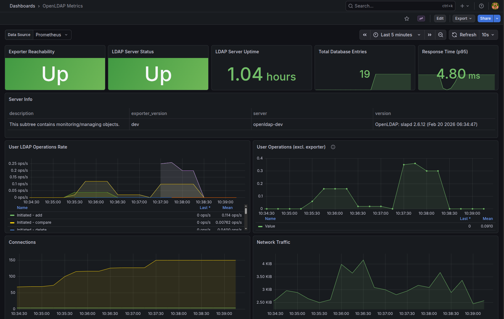
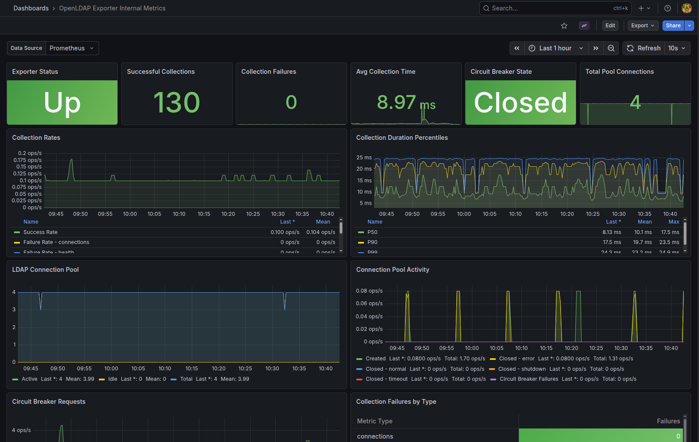

# OpenLDAP Prometheus Exporter

A Prometheus exporter for OpenLDAP with advanced security features, performance optimizations, and comprehensive monitoring using the [*Monitor backend*](https://www.openldap.org/doc/admin26/monitoringslapd.html), [*ppolicy overlay*](https://www.openldap.org/doc/admin26/overlays.html#Password%20Policies), and [*accesslog overlay*](https://www.openldap.org/doc/admin26/overlays.html#Access%20Logging)

## Features

### Security features

- **Credential Lifecycle**: passwords live in a `SecureString` byte buffer that `Clear()` zeros explicitly; the type also exposes a `WithPlaintext(func([]byte))` closure API so callers can consume the credential without leaking an immutable Go `string` copy onto the heap. (Pure-Go process memory cannot be locked, so the type does not pretend to provide cryptographic at-rest protection — see the godoc threat model.)
- **LDAP Input Validation**: DN parsing delegates to `ldap.ParseDN` (RFC 4514) and filter values must be escaped via `EscapeFilterValue` (`ldap.EscapeFilter`, RFC 4515) before being interpolated into a search filter
- **Trusted-Proxy Allowlist**: rate limiting only honors `X-Forwarded-For` / `X-Real-IP` when the immediate peer matches a configured CIDR (`HTTP_TRUSTED_PROXIES`); otherwise the peer's `RemoteAddr` is used and proxy headers are ignored
- **Rate Limiting**: token-bucket rate limiting per client IP with fractional accrual (no truncated-to-zero starvation) and a per-IP TTL sweeper
- **Security Headers**: Full set of security headers (CSP, HSTS, X-Frame-Options, etc.)
- **Circuit Breaker**: bounded half-open probes, rolling failure window in closed state, `errors.Is` based detection of the open sentinel
- **Web Config (exporter-toolkit)**: Optional TLS and basic auth on `/metrics` via `--web.config.file`
- **SASL EXTERNAL Auth**: Support for mTLS client certificate authentication to LDAP
- **Safe Logging**: Automatic redaction of sensitive information in logs; every emitter (zerolog, exporter-toolkit slog, net/http and promhttp `ErrorLog`) outputs structured JSON on stderr

### Performance optimizations

- **Connection Pooling**: Reusable LDAP connections with configurable pool size, snapshot-based health check that never holds the per-connection mutex across network I/O
- **Serialized Collect()**: a single mutex around the Prometheus `Collect()` body so concurrent scrapes do not race on the delta-based counter updates while the LDAP round-trips remain the actual bottleneck
- **Scrape-scoped context**: every LDAP `Search*` call derives its timeout from the current scrape context, so cancelling a scrape (or process shutdown) propagates to in-flight requests instead of running under a detached `context.Background()`
- **Metric Filtering**: Reduce overhead by collecting only needed metrics
- **Domain Filtering**: Filter by domain components to reduce LDAP queries
- **Retry Logic**: Exponential backoff with jitter for transient failures, classified via typed `errors.Is` / `errors.As` (no fragile substring matching)

## Support

- Compatible with OpenLDAP 2.4+
- Tested with Bitnami OpenLDAP and cleanstart/openldap containers

---

## Grafana Dashboards

This project includes two pre-built Grafana dashboards for comprehensive monitoring:

### OpenLDAP metrics dashboard

Monitor your OpenLDAP server performance with key metrics including operations, connections, threads, and database statistics.



**Dashboard JSON**: [`grafana/dashboards/openldap-metrics.json`](./grafana/dashboards/openldap-metrics.json)

**Features:**

- Server status indicators (health, uptime, database entries, response time)
- User LDAP operations rate (add, modify, delete, compare, extended) — exporter-generated operations (search/bind) and monitor operations are excluded
- Connection monitoring (current, total, by protocol)
- Thread pool status and waiters
- Network traffic statistics (bytes, entries, PDUs)
- Database and backend information tables
- Collapsible Information section (overlays, listeners, TLS, supported controls)
- Collapsible Replication section (lag, CSN timestamps)
- Collapsible Password Policy section (per-user failure count, account lock status, password age)
- Collapsible Access Log section (bind successes/failures per user, write operations per user)

### OpenLDAP exporter internal metrics dashboard

Monitor the exporter itself with detailed performance and health metrics.



**Dashboard JSON**: [`grafana/dashboards/exporter-internal-metrics.json`](./grafana/dashboards/exporter-internal-metrics.json)

**Features:**

- Exporter status and collection statistics
- Connection pool monitoring (utilization, operations, get/put rates)
- Circuit breaker state and requests
- Collection latency percentiles (P50, P90, P99)
- System metrics (uptime, goroutines, memory by type)
- Pool details (health checks, wait time percentiles, timeouts)
- Exporter LDAP activity (search/bind rates, network traffic to LDAP)
- Rate limiting monitoring

### Quick Setup

1. Import the dashboard JSON files into your Grafana instance
2. Configure Prometheus as a data source
3. Update the data source variable in each dashboard to match your Prometheus instance

> **Important:** The dashboards expect Prometheus job names `openldap-exporter` (for `/metrics`) and `openldap-exporter-internal` (for `/internal/metrics`). Adjust the `job_name` in your Prometheus config or update the dashboard queries if you use different names.

---

## Quick Start

### Docker compose (recommended)

```yaml
services:
  openldap-exporter:
    image: ghcr.io/maximewewer/openldap_prometheus_exporter:latest
    hostname: openldap-exporter
    container_name: openldap-exporter
    restart: unless-stopped
    ports:
      - "9330:9330"
    environment:
      # LDAP Configuration
      - LDAP_URL=ldap://openldap:1389
      - LDAP_USERNAME=cn=adminconfig,cn=config
      - LDAP_PASSWORD=adminpasswordconfig
      - LDAP_SERVER_NAME=prod-ldap-01
      
      # Logging Configuration
      - LOG_LEVEL=INFO  # DEBUG for more details
      
      # TLS Configuration (if needed)
      - LDAP_TLS=false
      - LDAP_TLS_SKIP_VERIFY=false
      - LDAP_TIMEOUT=10
      - LDAP_UPDATE_EVERY=15
    logging:
      driver: json-file
      options:
        "max-size": "10m"
        "max-file": "5"
```

### Docker

```bash
docker run -p 9330:9330 \
  -e LDAP_URL=ldap://myldap.domain.com:389 \
  -e LDAP_USERNAME=cn=adminconfig,cn=config \
  -e LDAP_PASSWORD=secret \
  -e LDAP_SERVER_NAME=ldap-prod-01 \
  -e LOG_LEVEL=INFO \
  ghcr.io/maximewewer/openldap_prometheus_exporter:latest
```

## Prometheus configuration

```yaml
global:
  scrape_interval: 15s
  evaluation_interval: 15s
  scrape_timeout: 10s

scrape_configs:
  - job_name: 'openldap-exporter'
    static_configs:
      - targets: ['openldap-exporter:9330']
        labels:
          instance: 'openldap-dev'
    metrics_path: '/metrics'
    scrape_interval: 30s
    scrape_timeout: 10s

  - job_name: 'openldap-exporter-internal'
    static_configs:
      - targets: ['openldap-exporter:9330']
        labels:
          instance: 'openldap-dev'
    metrics_path: '/internal/metrics'
    scrape_interval: 15s
    scrape_timeout: 5s
```

## Required OpenLDAP configuration

### 1. Monitor backend activation

The Monitor backend must be enabled on your OpenLDAP server.

```ldif
# This LDIF ensures the Monitor backend is properly configured
# Note: Bitnami OpenLDAP already has Monitor backend enabled, so we just modify existing configuration

# Ensure Monitor backend is enabled for monitoring
dn: olcDatabase={1}monitor,cn=config
changetype: modify
replace: olcMonitoring
olcMonitoring: TRUE
```

### 2. Base DN monitoring activation

**Important:** You must manually activate monitoring for each **Base DN** you want to monitor. The exporter automatically detects configured bases but cannot activate them.

```ldif
# This configures monitoring for the main database
# Note: Database numbering varies by installation:
#   Bitnami OpenLDAP: {0}config, {1}monitor, {2}mdb
#   cleanstart/openldap: {0}config, {1}mdb, {2}monitor

# Configure main database monitoring
dn: olcDatabase={2}mdb,cn=config
changetype: modify
replace: olcMonitoring
olcMonitoring: TRUE
```

### 3. ACL configuration

The account used (recommended: `adminconfig`. `LDAP_CONFIG_ADMIN` is used) must have read access to the Monitor backend. For `ppolicy` metrics, it also needs read access to user entries in the data tree:

```ldif
# This file configures access control lists to allow adminconfig to read Monitor & Backend

dn: olcDatabase={1}monitor,cn=config
changetype: modify
replace: olcAccess
olcAccess: to dn.subtree="cn=Monitor" by dn.exact="cn=adminconfig,cn=config" read by * none

dn: olcDatabase={0}config,cn=config
changetype: modify
replace: olcAccess
olcAccess: to * by dn.exact="cn=adminconfig,cn=config" manage by * none
```

For **ppolicy** metrics, the exporter account must be able to read user entries (ppolicy operational attributes like `pwdFailureTime`, `pwdAccountLockedTime`, etc.):

```ldif
# Grant read access to user entries for ppolicy monitoring
# Add this to your data database ACLs (adjust database number and base DN)
dn: olcDatabase={1}mdb,cn=config
changetype: modify
add: olcAccess
olcAccess: to dn.subtree="ou=users,dc=example,dc=org"
  by dn.exact="cn=adminconfig,cn=config" read
```

### 4. Accesslog overlay (optional)

The `accesslog` metric group requires the `slapo-accesslog` overlay to be configured. This provides per-user bind and write operation tracking.

```ldif
# 1. Load the accesslog module
dn: cn=module{0},cn=config
changetype: modify
add: olcModuleLoad
olcModuleLoad: accesslog.so

# 2. Create a dedicated MDB database for access logs
dn: olcDatabase={2}mdb,cn=config
objectClass: olcDatabaseConfig
objectClass: olcMdbConfig
olcDatabase: {2}mdb
olcSuffix: cn=accesslog
olcDbDirectory: /var/lib/openldap/accesslog-data
olcRootDN: cn=adminconfig,cn=config
olcDbMaxSize: 1073741824
olcDbIndex: reqStart eq
olcDbIndex: reqDN eq
olcDbIndex: reqType eq
olcDbIndex: reqResult eq
olcAccess: {0}to * by dn.exact="cn=adminconfig,cn=config" read by * none

# 3. Add the accesslog overlay to the main database
dn: olcOverlay=accesslog,olcDatabase={1}mdb,cn=config
objectClass: olcOverlayConfig
objectClass: olcAccessLogConfig
olcOverlay: accesslog
olcAccessLogDB: cn=accesslog
olcAccessLogOps: writes bind
olcAccessLogSuccess: FALSE
olcAccessLogPurge: 07+00:00 01+00:00
```

> **Note:** `olcAccessLogSuccess: FALSE` logs both successful and failed operations. `olcAccessLogPurge: 07+00:00 01+00:00` purges entries older than 7 days, checked every day. Adjust the database number (`{2}mdb`) to match your configuration — the monitor database number will need to be incremented accordingly.

## Configuration

### LDAP configuration (required)

| Variable | Description | Default | Example |
|----------|-------------|---------|---------|
| `LDAP_URL` | LDAP server URL | *Required* | `ldap://localhost:389` |
| `LDAP_USERNAME` | Username for LDAP authentication | *Required* | `cn=admin,dc=example,dc=com` |
| `LDAP_PASSWORD` | Password for LDAP authentication | *Required** | `password123` |
| `LDAP_PASSWORD_FILE` | Path to a file containing the password | | `/run/secrets/ldap_password` |

> \* One of `LDAP_PASSWORD` or `LDAP_PASSWORD_FILE` is required. `LDAP_PASSWORD_FILE` takes precedence when both are set.

> **Recommendation:** Use the `adminconfig` account which has access to `cn=config` and the Monitor backend.

#### Password from file (Docker / Kubernetes secrets)

`LDAP_PASSWORD_FILE` allows loading the password from a file instead of an environment variable. This is the recommended approach for production deployments using Docker secrets or Kubernetes secrets.

**Docker Compose with secrets:**

```yaml
services:
  openldap-exporter:
    image: ghcr.io/maximewewer/openldap_prometheus_exporter:latest
    ports:
      - "9330:9330"
    environment:
      - LDAP_URL=ldap://openldap:1389
      - LDAP_USERNAME=cn=adminconfig,cn=config
      - LDAP_PASSWORD_FILE=/run/secrets/ldap_password
      - LDAP_SERVER_NAME=prod-ldap-01
    secrets:
      - ldap_password

secrets:
  ldap_password:
    file: ./secrets/ldap_password.txt
```

**Kubernetes with secrets:**

```yaml
apiVersion: apps/v1
kind: Deployment
spec:
  template:
    spec:
      containers:
        - name: openldap-exporter
          image: ghcr.io/maximewewer/openldap_prometheus_exporter:latest
          env:
            - name: LDAP_URL
              value: "ldap://openldap:389"
            - name: LDAP_USERNAME
              value: "cn=adminconfig,cn=config"
            - name: LDAP_PASSWORD_FILE
              value: "/etc/secrets/ldap-password"
          volumeMounts:
            - name: ldap-secret
              mountPath: /etc/secrets
              readOnly: true
      volumes:
        - name: ldap-secret
          secret:
            secretName: ldap-credentials
            items:
              - key: password
                path: ldap-password
```

The file content is trimmed of trailing newlines. The raw bytes are cleared from memory after reading.

### LDAP configuration (optional)

| Variable | Description | Default | Example |
|----------|-------------|---------|---------|
| `LDAP_SERVER_NAME` | LDAP server name for logs and metrics | `openldap` | `ldap-prod-01` |
| `LDAP_TLS` | Use TLS for connection | `false` | `true` |
| `LDAP_TIMEOUT` | LDAP connection timeout (seconds) | `10` | `30` |
| `LDAP_UPDATE_EVERY` | Metrics update interval (seconds) | `15` | `30` |
| `LDAP_AUTH_METHOD` | Authentication method (`simple` or `external`) | `simple` | `external` |
| `LDAP_TLS_SKIP_VERIFY` | Skip TLS certificate verification | `false` | `true` |
| `LDAP_TLS_CA` | Path to CA certificate for TLS | | `/path/to/ca.crt` |
| `LDAP_TLS_CERT` | Path to client certificate | | `/path/to/client.crt` |
| `LDAP_TLS_KEY` | Path to client private key | | `/path/to/client.key` |
| `LDAP_TLS_SERVER_NAME` | TLS SNI / certificate-verification hostname (defaults to the host in `LDAP_URL`) | | `ldap.example.com` |

> **`LDAP_TLS_SERVER_NAME`**: by default TLS verification uses the host parsed from `LDAP_URL`, so dialing by IP requires an IP SAN in the certificate. Set this to verify against a DNS SAN instead while still connecting by IP. Note `LDAP_SERVER_NAME` is only the logs/metrics label and has no effect on TLS.

> **SASL EXTERNAL**: Set `LDAP_AUTH_METHOD=external` to authenticate using the TLS client certificate (`LDAP_TLS_CERT`/`LDAP_TLS_KEY`) instead of username/password. In this mode, `LDAP_USERNAME` and `LDAP_PASSWORD` are not required.

### Circuit breaker configuration (optional)

The LDAP client wraps every search in a circuit breaker that opens after repeated failures to avoid hammering an unhealthy server. The metric-scrape path and the events stream each have their own independent breaker (distinguished by the `component` label). These thresholds apply to both.

| Variable | Description | Default | Example |
|----------|-------------|---------|---------|
| `CIRCUIT_BREAKER_MAX_FAILURES` | Failures before the breaker opens | `3` | `5` |
| `CIRCUIT_BREAKER_TIMEOUT` | Time the breaker stays open before a half-open probe (seconds) | `60` | `30` |
| `CIRCUIT_BREAKER_RESET_TIMEOUT` | Half-open window (seconds) | `15` | `10` |
| `CIRCUIT_BREAKER_SUCCESS_THRESHOLD` | Consecutive successes needed to close | `2` | `3` |

### HTTP server configuration

| Variable | Description | Default | Example |
|----------|-------------|---------|---------|
| `LISTEN_ADDRESS` | HTTP server listen address | `:9330` | `:8080` |
| `WEB_CONFIG_FILE` | Path to web config file (TLS/basic auth) | | `/etc/exporter/web-config.yml` |
| `HTTP_READ_TIMEOUT` | HTTP read timeout | `10s` | `30s` |
| `HTTP_WRITE_TIMEOUT` | HTTP write timeout | `10s` | `30s` |
| `HTTP_IDLE_TIMEOUT` | HTTP idle timeout | `60s` | `120s` |
| `HTTP_SHUTDOWN_TIMEOUT` | Graceful shutdown timeout | `30s` | `60s` |

> The `--web.config.file` flag (or `WEB_CONFIG_FILE` env) enables TLS and/or basic auth on all HTTP endpoints using [exporter-toolkit](https://github.com/prometheus/exporter-toolkit). This follows the standard Prometheus ecosystem convention used by node_exporter, blackbox_exporter, etc.

**Example `web-config.yml`:**

```yaml
# TLS configuration
tls_server_config:
  cert_file: /path/to/cert.pem
  key_file: /path/to/key.pem

# Basic authentication (bcrypt hashed passwords)
basic_auth_users:
  prometheus: $2y$10$xxxxxxxxxxxxxxxxxxxxxxxxxxxxxxxxxxxxxxxxxxxxxxxxxxxx
```

See the full [web configuration documentation](https://github.com/prometheus/exporter-toolkit/blob/master/docs/web-configuration.md) for all options.

### Rate limiting configuration

| Variable | Description | Default | Example |
|----------|-------------|---------|---------|
| `RATE_LIMIT_ENABLED` | Enable/disable rate limiting | `true` | `false` |
| `RATE_LIMIT_REQUESTS` | Requests per minute for /metrics | `30` | `100` |
| `RATE_LIMIT_BURST` | Burst size for /metrics | `10` | `20` |
| `HEALTH_RATE_LIMIT_REQUESTS` | Requests per minute for /health | `60` | `120` |
| `HEALTH_RATE_LIMIT_BURST` | Burst size for /health | `20` | `40` |
| `HTTP_TRUSTED_PROXIES` | Comma-separated CIDRs (or bare IPs) of trusted reverse proxies. Only requests whose peer address matches one of these entries are allowed to override the source IP via `X-Forwarded-For` / `X-Real-IP`; everything else uses `RemoteAddr` directly. Empty (the default) disables proxy-header trust entirely. | *(empty)* | `10.0.0.0/8,172.16.0.0/12` |

### Logging configuration

| Variable | Description | Default | Example |
|----------|-------------|---------|---------|
| `LOG_LEVEL` | Log level | `INFO` | `DEBUG` |

**Available log levels:**

- `DEBUG`: All logs (very verbose)
- `INFO`: General information
- `WARN`: Warnings
- `ERROR`: Errors only
- `FATAL`: Fatal errors only

### Metrics filtering configuration

| Variable | Description | Example |
|----------|-------------|---------|
| `OPENLDAP_METRICS_INCLUDE` | Only collect these metric groups | `connections,statistics,health,server` |
| `OPENLDAP_METRICS_EXCLUDE` | Exclude these metric groups | `overlays,tls,backends,log,sasl` |

**Available metric groups:** `connections`, `statistics`, `operations`, `threads`, `time`, `waiters`, `overlays`, `tls`, `backends`, `listeners`, `health`, `database`, `server`, `log`, `sasl`, `replication`, `ppolicy`, `accesslog`

**Filtering Logic:**

1. **INCLUDE Mode**: If `OPENLDAP_METRICS_INCLUDE` is defined, only listed metrics are collected
2. **EXCLUDE Mode**: If `OPENLDAP_METRICS_EXCLUDE` is defined (without INCLUDE), all metrics except listed ones are collected
3. **DEFAULT Mode**: If no filters are defined, all metrics are collected

### Domain component (DC) filtering

| Variable | Description | Example |
|----------|-------------|---------|
| `OPENLDAP_DC_INCLUDE` | Only monitor these domain components | `example,company,test` |
| `OPENLDAP_DC_EXCLUDE` | Exclude these domain components | `dev,staging` |

**Filtering Logic:**

1. **INCLUDE Mode**: If `OPENLDAP_DC_INCLUDE` is defined, only listed domains are monitored
2. **EXCLUDE Mode**: If `OPENLDAP_DC_EXCLUDE` is defined (without INCLUDE), all domains except listed ones are monitored
3. **DEFAULT Mode**: If no filters are defined, all domains are monitored

**Domain Component Extraction:**

- `dc=example,dc=org` → Components: `["example", "org"]`
- `ou=users,dc=company,dc=net` → Components: `["company", "net"]`
- `uid=user1,ou=people,dc=test,dc=local` → Components: `["test", "local"]`

### JSON events stream (optional)

In addition to Prometheus metrics, the exporter can emit a stream of structured **JSON events** derived from the `slapo-accesslog` overlay (binds, writes, account locks, password changes, …). It is meant for log shippers (Loki, Vector, Fluent Bit, …) that want event-by-event records rather than aggregated counters.

The events stream runs in its **own goroutine, on its own ticker, with its own `reqStart` cursor**, and uses its **own dedicated LDAP connection pool and circuit breaker** (labeled `component`/`pool_type=events`), completely independent of Prometheus scrapes. Enabling it does not perturb metric collection: a slow or failing accesslog scan on the events ticker cannot drain the scrape pool or trip the scrape's breaker, and metric scrapes do not drain the event stream before it is observed. A failure on one stream (bind / write / lock) does not freeze the others.

| Variable | Description | Default |
|----------|-------------|---------|
| `OPENLDAP_EVENTS_ENABLED` | Enable the JSON events stream | `false` |
| `OPENLDAP_EVENTS_INTERVAL` | Scan interval (Go duration, e.g. `30s`, `1m`) — clamped to `[5s, 30m]` | `30s` |
| `OPENLDAP_EVENTS_OUTPUT` | `stdout` or a filesystem path. The token `{date}` in the path is replaced by the current UTC day | `stdout` |
| `OPENLDAP_EVENTS_ROTATION` | `none` (append to a single file) or `daily` (roll at UTC midnight, see below) — file output only | `none` |
| `OPENLDAP_EVENTS_TYPES` | Comma-separated allow-list. Empty = emit all types | *(all)* |

**Event types**

| Type | Source | Notes |
|------|--------|-------|
| `bind.success` | `auditBind` `reqResult=0` | |
| `bind.failure` | `auditBind` `reqResult!=0` | `result_code` carries the raw LDAP code, `result` the human label (`invalid_credentials`, …) |
| `account.lock` | `auditModify` adding/replacing `pwdAccountLockedTime` | |
| `account.unlock` | `auditModify` deleting `pwdAccountLockedTime` | |
| `password.change` | `auditModify` touching `userPassword` or `pwdChangedTime` | Emitted **in addition** to the corresponding `write.modify` event |
| `password.reset_required` | `auditModify` adding `pwdReset=TRUE` | Emitted **in addition** to `write.modify` |
| `write.add` / `write.modify` / `write.delete` / `write.modrdn` | `auditAdd` / `auditModify` / `auditDelete` / `auditModRDN` | `attributes` lists modified attribute names for `modify` |

**Output format** — one JSON object per line (JSON Lines):

```json
{"ts":"2026-04-13T14:22:01.123Z","event":"bind.failure","server":"ldap-prod-1","source":"accesslog","req_start":"20260413142201.123456Z","req_session":"1234","actor":"","user_dn":"uid=arthur.meyer,ou=users,dc=iph,dc=lan","result":"invalid_credentials","result_code":"49"}
{"ts":"2026-04-13T14:22:02.050Z","event":"account.lock","server":"ldap-prod-1","source":"accesslog","req_start":"20260413142202.050000Z","actor":"cn=admin,dc=iph,dc=lan","user_dn":"uid=arthur.meyer,ou=users,dc=iph,dc=lan"}
```

Common fields: `ts`, `event`, `server`, `source`, `req_start`, `req_session`, `actor`. Per-type extras: `user_dn`, `target_dn`, `result`, `result_code`, `operation`, `attributes`.

**Output destinations**

- **`stdout`** (default) — recommended for Docker / Kubernetes deployments. Let your container runtime collect the lines and feed them to the log shipper of your choice.
- **File, no rotation** — `OPENLDAP_EVENTS_OUTPUT=/var/log/openldap-events.jsonl` `OPENLDAP_EVENTS_ROTATION=none`. Appends forever; pair with `logrotate` if needed.
- **File, daily rotation** — `OPENLDAP_EVENTS_OUTPUT=/var/log/openldap-events-{date}.jsonl` `OPENLDAP_EVENTS_ROTATION=daily`. A new file is opened automatically at UTC midnight; if the path does not contain `{date}`, the suffix `.YYYY-MM-DD` is appended to the configured filename. No size cap, no compression — keep heavy lifecycles for `logrotate` or a log shipper.

**Baseline behaviour** — the very first scan after a restart only **records** the maximum `reqStart` found in each stream and emits nothing. Subsequent ticks emit every entry strictly newer than the cursor. This avoids back-filling the entire `cn=accesslog` window as a spike when the exporter starts up.

**Filtering** — set `OPENLDAP_EVENTS_TYPES=bind.failure,account.lock,password.change` to only emit the event types you care about; everything else is dropped at the emitter.

**Requirements** — the `slapo-accesslog` overlay must be configured on the OpenLDAP server (see [Accesslog overlay configuration](#4-accesslog-overlay-optional)) and the exporter account must have read access to `cn=accesslog`.

## Exported metrics

The exporter exposes two types of metrics:

1. **OpenLDAP metrics** (namespace `openldap`) - collected from LDAP server via `cn=Monitor`, user entries (ppolicy), and `cn=accesslog`
2. **Internal metrics** (namespace `openldap_exporter`) - exporter performance and health

### OpenLDAP metrics (namespace: `openldap`)

These metrics are collected in different configurable groups. Use `OPENLDAP_METRICS_INCLUDE` or `OPENLDAP_METRICS_EXCLUDE` to filter groups according to your needs.

### Connections (`connections`)

| Metric | Type | Labels | Description | LDAP Source |
|----------|------|---------|-------------|-------------|
| `openldap_connections_current` | Gauge | `server` | Current number of connections | `cn=Current,cn=Connections,cn=Monitor` |
| `openldap_connections_total` | Counter | `server` | Total number of connections (cumulative) | `cn=Total,cn=Connections,cn=Monitor` |
| `openldap_connections_by_protocol` | Gauge | `server`, `protocol` | Number of connections by LDAP protocol version | Individual `cn=Connection X` entries |
| `openldap_connection_ops_aggregate` | Gauge | `server`, `state` | Aggregate ops across all connections (executing, pending, received, completed) | Individual `cn=Connection X` entries |

### Statistics (`statistics`)

| Metric | Type | Labels | Description | LDAP Source |
|----------|------|---------|-------------|-------------|
| `openldap_bytes_total` | Counter | `server` | Total bytes transmitted | `cn=Bytes,cn=Statistics,cn=Monitor` |
| `openldap_entries_total` | Counter | `server` | Total entries sent | `cn=Entries,cn=Statistics,cn=Monitor` |
| `openldap_referrals_total` | Counter | `server` | Total referrals sent | `cn=Referrals,cn=Statistics,cn=Monitor` |
| `openldap_pdu_total` | Counter | `server` | Total PDUs processed | `cn=PDU,cn=Statistics,cn=Monitor` |

### Operations (`operations`)

| Metric | Type | Labels | Description | LDAP Source |
|----------|------|---------|-------------|-------------|
| `openldap_operations_initiated_total` | Counter | `server`, `operation` | Operations initiated by type | `cn=Operations,cn=Monitor` |
| `openldap_operations_completed_total` | Counter | `server`, `operation` | Operations completed by type | `cn=Operations,cn=Monitor` |

**Available operation types:** `bind`, `unbind`, `add`, `delete`, `modify`, `modrdn`, `compare`, `search`, `abandon`, `extended`

### Threads (`threads`)

| Metric | Type | Labels | Description | LDAP Source |
|----------|------|---------|-------------|-------------|
| `openldap_threads_max` | Gauge | `server` | Maximum number of threads | `cn=Max,cn=Threads,cn=Monitor` |
| `openldap_threads_max_pending` | Gauge | `server` | Maximum number of pending threads | `cn=Max Pending,cn=Threads,cn=Monitor` |
| `openldap_threads_backload` | Gauge | `server` | Thread workload | `cn=Backload,cn=Threads,cn=Monitor` |
| `openldap_threads_active` | Gauge | `server` | Active threads | `cn=Active,cn=Threads,cn=Monitor` |
| `openldap_threads_open` | Gauge | `server` | Open threads | `cn=Open,cn=Threads,cn=Monitor` |
| `openldap_threads_starting` | Gauge | `server` | Starting threads | `cn=Starting,cn=Threads,cn=Monitor` |
| `openldap_threads_pending` | Gauge | `server` | Pending threads | `cn=Pending,cn=Threads,cn=Monitor` |
| `openldap_threads_state` | Gauge | `server`, `state` | Thread pool state | `cn=State,cn=Threads,cn=Monitor` |

### Time (`time`)

| Metric | Type | Labels | Description | LDAP Source |
|----------|------|---------|-------------|-------------|
| `openldap_server_time` | Gauge | `server` | Current server timestamp | `cn=Current,cn=Time,cn=Monitor` |
| `openldap_server_uptime_seconds` | Gauge | `server` | Server uptime in seconds | `cn=Start,cn=Time,cn=Monitor` |

### Waiters (`waiters`)

| Metric | Type | Labels | Description | LDAP Source |
|----------|------|---------|-------------|-------------|
| `openldap_waiters_read` | Gauge | `server` | Number of read waiters | `cn=Read,cn=Waiters,cn=Monitor` |
| `openldap_waiters_write` | Gauge | `server` | Number of write waiters | `cn=Write,cn=Waiters,cn=Monitor` |

### Overlays (`overlays`)

| Metric | Type | Labels | Description | LDAP Source |
|----------|------|---------|-------------|-------------|
| `openldap_overlays_info` | Gauge | `server`, `overlay`, `status` | Information about loaded overlays | `cn=Overlays,cn=Monitor` |

### TLS (`tls`)

| Metric | Type | Labels | Description | LDAP Source |
|----------|------|---------|-------------|-------------|
| `openldap_tls_info` | Gauge | `server`, `component`, `status` | TLS configuration information | `cn=TLS,cn=Monitor` |
| `openldap_tls_cert_not_after_timestamp_seconds` | Gauge | `server`, `usage`, `subject`, `issuer`, `serial` | Expiration (NotAfter) of the certificates in the server's live TLS chain, as a Unix timestamp. `usage="server"` is the leaf certificate, `usage="ca"` covers the intermediate/root CAs. Only emitted when TLS is enabled. | Live TLS handshake |

### Backends (`backends`)

| Metric | Type | Labels | Description | LDAP Source |
|----------|------|---------|-------------|-------------|
| `openldap_backends_info` | Gauge | `server`, `backend`, `type` | Information about available backends | `cn=Backends,cn=Monitor` |

### Listeners (`listeners`)

| Metric | Type | Labels | Description | LDAP Source |
|----------|------|---------|-------------|-------------|
| `openldap_listeners_info` | Gauge | `server`, `listener`, `address` | Information about active listeners | `cn=Listeners,cn=Monitor` |

### Database (`database`)

| Metric | Type | Labels | Description | LDAP Source |
|----------|------|---------|-------------|-------------|
| `openldap_database_entries` | Gauge | `server`, `base_dn`, `domain_component` | Number of entries per base DN with domain component filtering | `cn=Database,cn=Monitor` |
| `openldap_database_info` | Gauge | `server`, `base_dn`, `is_shadow`, `context`, `readonly` | Database metadata | `cn=Database,cn=Monitor` |

### Server (`server`)

| Metric | Type | Labels | Description | LDAP Source |
|----------|------|---------|-------------|-------------|
| `openldap_server_info` | Gauge | `server`, `version`, `exporter_version`, `description` | OpenLDAP server and exporter version info | `cn=Monitor` |
| `openldap_supported_control_info` | Gauge | `server`, `oid` | LDAP controls supported by the server | RootDSE `supportedControl` |

### Log (`log`)

| Metric | Type | Labels | Description | LDAP Source |
|----------|------|---------|-------------|-------------|
| `openldap_log_level_enabled` | Gauge | `server`, `log_type` | Enabled log levels (1=enabled, 0=disabled) | `cn=Log,cn=Monitor` |

**Available log types:** `Trace`, `Packets`, `Args`, `Conns`, `BER`, `Filter`, `Config`, `ACL`, `Stats`, `Stats2`, `Shell`, `Parse`, `Sync`

### SASL (`sasl`)

| Metric | Type | Labels | Description | LDAP Source |
|----------|------|---------|-------------|-------------|
| `openldap_sasl_info` | Gauge | `server`, `mechanism`, `status` | SASL authentication mechanisms configuration | `cn=SASL,cn=Monitor` |

### Replication (`replication`)

| Metric | Type | Labels | Description | LDAP Source |
|----------|------|---------|-------------|-------------|
| `openldap_replication_csn_timestamp` | Gauge | `server`, `base_dn`, `server_id` | Unix timestamp from contextCSN per database and server ID | `contextCSN` on suffix entry |
| `openldap_replication_lag_seconds` | Gauge | `server`, `base_dn`, `server_id` | Seconds since last contextCSN update | Calculated |

These metrics are only populated when `contextCSN` is present on database suffix entries (i.e., when replication is configured). In multi-master setups, one series per server ID (SID) is exposed, allowing lag detection between replicas.

### Password Policy (`ppolicy`)

| Metric | Type | Labels | Description | LDAP Source |
|----------|------|---------|-------------|-------------|
| `openldap_ppolicy_pwd_changed_timestamp` | Gauge | `server`, `user_dn`, `user`, `base_dn` | Unix timestamp of last password change | `pwdChangedTime` operational attribute |
| `openldap_ppolicy_pwd_last_success_timestamp` | Gauge | `server`, `user_dn`, `user`, `base_dn` | Unix timestamp of last successful bind | `pwdLastSuccess` operational attribute |
| `openldap_ppolicy_pwd_grace_use_count` | Gauge | `server`, `user_dn`, `user`, `base_dn` | Grace logins used after password expiration | `pwdGraceUseTime` operational attribute |
| `openldap_ppolicy_pwd_reset` | Gauge | `server`, `user_dn`, `user`, `base_dn` | Must change password on next bind (1=yes, 0=no) | `pwdReset` operational attribute |

These metrics require the `slapo-ppolicy` overlay to be configured on the OpenLDAP server. The exporter account must have read access to user entries (see [ACL configuration](#3-acl-configuration)). Only users with at least one ppolicy operational attribute set are reported.

> **Event-based failures & locks:** per-user bind failure counts and account-lock events are **not** exposed by the ppolicy collector. `pwdFailureTime` and `pwdAccountLockedTime` are persisted state and, exposed as gauges, make time-series graphs show flat lines that keep repeating the same event on every scrape. The exporter instead derives those events from the `accesslog` collector via an incremental `reqStart` cursor so that Prometheus sees each failure or lock as a point-in-time counter increment. Use `rate(openldap_accesslog_bind_total{result!="success"}[5m])` and `increase(openldap_accesslog_account_lock_events_total[$__range])` in place of the old `openldap_ppolicy_pwd_failure_count` / `openldap_ppolicy_account_locked` metrics.

### Access Log (`accesslog`)

| Metric | Type | Labels | Description | LDAP Source |
|----------|------|---------|-------------|-------------|
| `openldap_accesslog_bind_total` | Counter | `server`, `user`, `result` | Cumulative bind operations per user and result | `cn=accesslog` `auditBind` entries |
| `openldap_accesslog_write_total` | Counter | `server`, `user`, `operation` | Cumulative write operations per user and type | `cn=accesslog` `auditAdd/Modify/Delete/ModRDN` entries |
| `openldap_accesslog_account_lock_events_total` | Counter | `server`, `user` | Cumulative account lock events (auditModify setting `pwdAccountLockedTime`) | `cn=accesslog` `auditModify` entries with `reqMod=pwdAccountLockedTime:+...` |

**Cardinality safety.** The `user` label is driven by the first RDN of the binding DN, which is effectively controlled by clients. To stop a malicious or buggy client from exploding the exporter's memory with rotating bind DNs, every accesslog CounterVec is protected by a per-metric TTL sweeper and a hard cap:

- **Hard cap:** at most `10000` distinct label tuples per metric. New tuples beyond that limit are dropped (with a rate-limited warning) until the sweeper reclaims capacity.
- **TTL:** series idle for more than `1h` are deleted on the next sweep.
- **Sweep interval:** every `10m` the exporter walks the tracker and reaps stale entries.

These metrics require the `slapo-accesslog` overlay and a dedicated `cn=accesslog` MDB database (see [Accesslog overlay configuration](#4-accesslog-overlay-optional)).

The collector performs an **incremental scan**: on each scrape it queries only accesslog entries whose `reqStart` is newer than the cursor it stored on the previous scrape, then increments Prometheus counters once per matching entry. On the very first scrape the cursor is initialised from the current maximum `reqStart` without emitting increments, so pre-existing history is not back-filled as a spike. This yields true event-based counters that you can feed to `rate()` / `increase()` without having to subtract a sliding-window gauge.

**Result labels for binds:** `success`, `invalid_credentials`, `insufficient_access`, `constraint_violation`, `unwilling_to_perform`, `error_<code>`

**Operation labels for writes:** `add`, `modify`, `delete`, `modrdn`

### Health (`health`)

| Metric | Type | Labels | Description | Source |
|----------|------|---------|-------------|--------|
| `openldap_health_status` | Gauge | `server` | Server health status (1=healthy, 0=unhealthy) | Calculated |
| `openldap_response_time_seconds` | Histogram | `server` | Health check response time distribution | Calculated |
| `openldap_scrape_errors_total` | Counter | `server` | Total number of scrape errors | Internal |
| `openldap_up` | Gauge | `server` | Whether the OpenLDAP exporter is up (1) or not (0) | Internal |

### Internal exporter metrics (namespace: `openldap_exporter`)

These metrics are exposed on the `/internal/metrics` endpoint and allow monitoring the performance and health of the exporter itself.

#### Connection pool (`openldap_exporter_pool`)

The `pool_type` label is `ldap` for the metric-scrape pool and `events` for the events stream's own dedicated pool (when the events stream is enabled).

**Basic metrics**

| Metric | Type | Labels | Description |
|----------|------|---------|-------------|
| `openldap_exporter_pool_utilization_ratio` | Gauge | `server`, `pool_type` | Connection pool utilization ratio (0-1) |
| `openldap_exporter_pool_connections` | Gauge | `server`, `pool_type`, `state` | Number of connections by state (active, idle, total) |
| `openldap_exporter_pool_operations_total` | Counter | `server`, `pool_type`, `operation` | Total number of pool operations (get, put, create, close) |

**Connection lifecycle**

| Metric | Type | Labels | Description |
|----------|------|---------|-------------|
| `openldap_exporter_pool_connections_created_total` | Counter | `server`, `pool_type` | Total number of connections created |
| `openldap_exporter_pool_connections_closed_total` | Counter | `server`, `pool_type`, `reason` | Total number of connections closed (reason: normal, timeout, error, shutdown) |
| `openldap_exporter_pool_connections_failed_total` | Counter | `server`, `pool_type`, `error` | Total number of failed connection attempts |
| `openldap_exporter_pool_connections_reused_total` | Counter | `server`, `pool_type` | Total number of connections reused from the pool |

**Connection quality**

| Metric | Type | Labels | Description |
|----------|------|---------|-------------|
| `openldap_exporter_pool_wait_time_seconds` | Histogram | `server`, `pool_type` | Wait time to get a connection from the pool |
| `openldap_exporter_pool_wait_timeouts_total` | Counter | `server`, `pool_type` | Total number of connection wait timeouts |

**Health monitoring**

| Metric | Type | Labels | Description |
|----------|------|---------|-------------|
| `openldap_exporter_pool_health_checks_total` | Counter | `server`, `pool_type` | Total number of health checks performed |
| `openldap_exporter_pool_health_check_failures_total` | Counter | `server`, `pool_type` | Total number of health check failures |

**Operation details**

| Metric | Type | Labels | Description |
|----------|------|---------|-------------|
| `openldap_exporter_pool_get_requests_total` | Counter | `server`, `pool_type` | Total number of connection get requests |
| `openldap_exporter_pool_get_failures_total` | Counter | `server`, `pool_type`, `reason` | Total number of connection get failures (reason: timeout, creation_failed, max_attempts) |
| `openldap_exporter_pool_put_requests_total` | Counter | `server`, `pool_type` | Total number of connection put requests |
| `openldap_exporter_pool_put_rejections_total` | Counter | `server`, `pool_type`, `reason` | Total number of connection put rejections (reason: invalid_connection, pool_full) |

#### Circuit breaker (`openldap_exporter_circuit_breaker`)

The `component` label separates the metric-scrape breaker (`ldap`) from the events stream's independent breaker (`events`).

| Metric | Type | Labels | Description |
|----------|------|---------|-------------|
| `openldap_exporter_circuit_breaker_state` | Gauge | `server`, `component` | Circuit breaker state (0=closed, 1=half-open, 2=open) |
| `openldap_exporter_circuit_breaker_requests_total` | Counter | `server`, `component`, `result` | Total number of circuit breaker requests (allowed, blocked) |
| `openldap_exporter_circuit_breaker_failures_total` | Counter | `server`, `component` | Total number of circuit breaker failures |

#### Metrics collection (`openldap_exporter_collection`)

| Metric | Type | Labels | Description |
|----------|------|---------|-------------|
| `openldap_exporter_collection_latency_seconds` | Histogram | `server`, `metric_type` | Metrics collection latency |
| `openldap_exporter_collection_success_total` | Counter | `server`, `metric_type` | Total number of successful collections |
| `openldap_exporter_collection_failures_total` | Counter | `server`, `metric_type` | Total number of collection failures |


#### Rate limiting (`openldap_exporter_rate_limit`)

| Metric | Type | Labels | Description |
|----------|------|---------|-------------|
| `openldap_exporter_rate_limit_requests_total` | Counter | `client_ip`, `endpoint` | Total number of requests with rate limiting |
| `openldap_exporter_rate_limit_blocked_total` | Counter | `client_ip`, `endpoint` | Total number of requests blocked by rate limiting |

#### System (`openldap_exporter_system`)

| Metric | Type | Labels | Description |
|----------|------|---------|-------------|
| `openldap_exporter_system_goroutines` | Gauge | `server` | Number of active goroutines |
| `openldap_exporter_system_memory_bytes` | Gauge | `server`, `type` | Memory usage in bytes (heap, stack, sys) |
| `openldap_exporter_system_uptime_seconds` | Gauge | `server` | Exporter uptime in seconds |

## Endpoints

All endpoints include security headers and are subject to configured rate limiting.

### Main endpoints

| Endpoint | Type | Description | Content |
|----------|------|-------------|---------|
| `/` | HTML | Information page with version and configuration status | Web page showing version, active metric filters (include/exclude) |
| `/health` | JSON | Health check; reflects LDAP reachability | `{"status":"ok","ldap_reachable":true,"version":"x.x.x","timestamp":"2025-09-02T14:44:30Z","uptime":"12.64s"}` |
| `/metrics` | Text | OpenLDAP Prometheus metrics | All OpenLDAP metrics (namespace `openldap`) according to configured filtering |

> **`/health` status code**: returns `200` when the LDAP circuit breaker is closed/half-open and `503` (`"status":"unhealthy"`, `"ldap_reachable":false`) once it has opened, i.e. the exporter can no longer reach the LDAP server. The bundled image has no `curl`/`wget`, so use the binary's own probe as the container healthcheck: `openldap-exporter -healthcheck` exits `0` when `/health` returns `200` and `1` otherwise (it reads the port from `LISTEN_ADDRESS`).

### Internal endpoints

| Endpoint | Type | Description | Content |
|----------|------|-------------|---------|
| `/internal/metrics` | Text | Internal exporter metrics | Performance metrics (namespace `openldap_exporter`): pool, circuit breaker, collection, rate limiting, system |

### Rate limiting configuration

- **Endpoints `/metrics`, `/internal/metrics`**: `RATE_LIMIT_REQUESTS` req/min (default: 30), burst `RATE_LIMIT_BURST` (default: 10)
- **Endpoint `/health`**: `HEALTH_RATE_LIMIT_REQUESTS` req/min (default: 60), burst `HEALTH_RATE_LIMIT_BURST` (default: 20)
- **Endpoint `/`**: Same limit as `/metrics`

## Logging

The exporter uses a structured logging system in JSON format:

```json
{"level":"info","component":"openldap-exporter","server":"openldap-dev","duration":"15.711396ms","time":"2025-08-01T09:06:06Z","message":"Metrics collection completed successfully"}
```

**Available log levels:**

- `DEBUG`: Detailed logs of LDAP connections and searches
- `INFO`: Informational logs (default)
- `WARN`: Warnings
- `ERROR`: Non-fatal errors
- `FATAL`: Fatal errors (program termination)

## Troubleshooting

### Common errors

1. **LDAP connection error:**

   ```json
   {"level":"error","component":"openldap-exporter","error":"LDAP Result Code 49 \"Invalid Credentials\""}
   ```

   Check `LDAP_USERNAME` and `LDAP_PASSWORD`

2. **No access to monitor backend:**

   ```json
   {"level":"error","component":"openldap-exporter","error":"LDAP Result Code 32 \"No Such Object\""}
   ```

   Verify that the Monitor backend is enabled and accessible

3. **Invalid TLS certificates:**

   ```json
   {"level":"error","component":"openldap-exporter","error":"x509: certificate signed by unknown authority"}
   ```

   Configure `LDAP_TLS_CA` or use `LDAP_TLS_SKIP_VERIFY=true` (not recommended in production)

## Technical Architecture

- **Language:** Go 1.26
- **Logging:** [rs/zerolog](https://github.com/rs/zerolog) for high-performance structured logs; net/http and promhttp `ErrorLog` are routed through a slog JSON handler so every line on stderr stays parseable
- **LDAP:** [go-ldap/ldap/v3](https://github.com/go-ldap/ldap), with DN parsing and filter escaping handled by the upstream RFC-compliant helpers
- **Metrics:** Official Prometheus client with [exporter-toolkit](https://github.com/prometheus/exporter-toolkit) for HTTP auth/TLS
- **Security:** explicit credential lifecycle via `SecureString` (zero-on-Clear, closure-based plaintext access) — no fake at-rest encryption claim; trusted-proxy gate on `X-Forwarded-For`; LDAP filter / DN validation via `ldap.ParseDN` / `EscapeFilterValue`
- **Performance:** Connection pooling with bounded half-open circuit breaker, scrape-scoped context propagation into LDAP Search calls, retry with exponential backoff
- **Container:** Distroless static image for security
- **Build:** Multi-stage Docker build with static binary

## Development

- **Unit tests:** `go test ./...`
- **Lint:** `golangci-lint run` (config in `.golangci.yml`)
- **Integration tests:** boot the local stack in `tests/docker/` (`./setup.sh && docker compose up -d openldap tools`) then `go test -tags=integration ./tests/...`
- **End-to-end events validation:** same stack + `./tests/docker/scripts/trigger-events.sh`, then inspect `tests/docker/output/openldap-events-$(date -u +%F).jsonl`
- **CI:** `.github/workflows/quality-assurance.yml` runs the same `tests/docker/` stack on every push/PR.
